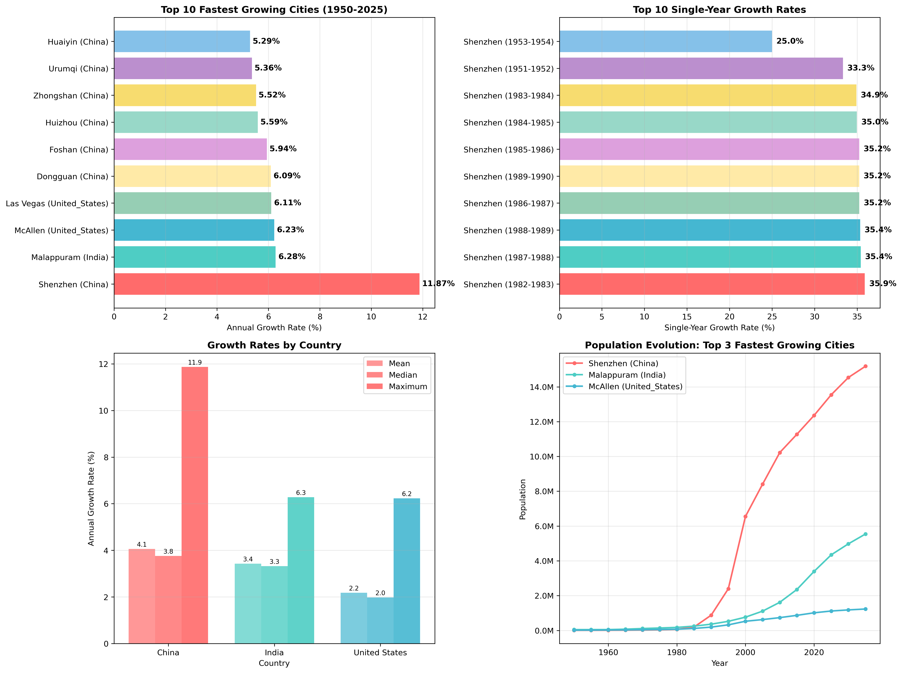
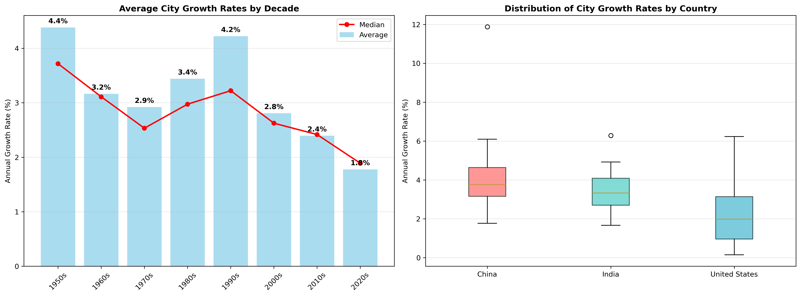
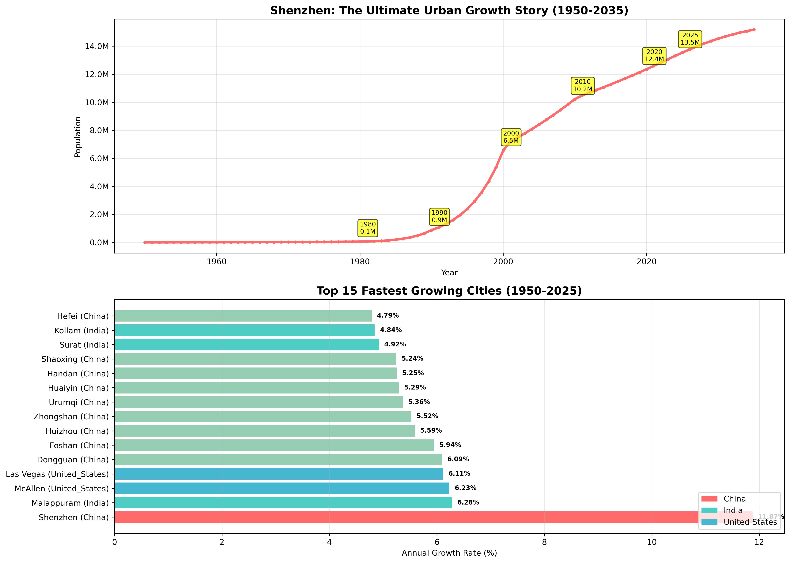

# Urban Population Growth Analysis (1950-2025)

An analysis of historical population data for 150 major cities across China, India, and the United States, examining patterns of urban growth over 75 years.

## Key Findings

### Top 3 Fastest Growing Cities Overall (1950-2025)

Based on compound annual growth rates over the 75-year period:

**1. Shenzhen (China)** experienced a 4,515x population increase over 75 years. The city grew at an annual rate of 11.87%, expanding from 3,000 residents to 13,545,000.

**2. Malappuram (India)** achieved a 96.5x population increase with a 6.28% annual growth rate, transforming from a town of 45,000 to a city of 4,344,000 residents.

**3. McAllen (United States)** experienced a 93x population increase at a 6.23% annual rate, growing from 12,000 to 1,116,000 residents over the study period.

### Top 3 Fastest Single-Year Growth Rates

The highest single-year population growth rates:

**1. Shenzhen (China) 1982-1983** recorded the highest single-year growth rate at 35.9%, with population increasing from 78,000 to 106,000 residents, representing an absolute gain of 28,000 people.

**2. Shenzhen (China) 1987-1988** achieved a 35.4% growth rate in one year, expanding from 353,000 to 478,000 residents, adding 125,000 new inhabitants.

**3. Shenzhen (China) 1988-1989** maintained the 35.4% annual growth rate, growing from 478,000 to 647,000 residents with an absolute increase of 169,000 people.

## Analysis Highlights

### Data Overview
This analysis examined 150 cities (50 from each country) using 86 years of historical data per city (1950-2035), totaling approximately 12,900 data points and 12,750 year-over-year transitions.

### Country Patterns

**China** shows significant growth patterns, with several cities experiencing rapid expansion during economic development periods, particularly from the 1980s through 2000s.

**India** demonstrates consistent high growth rates across multiple cities, reflecting steady urbanization trends and economic development.

**United States** shows moderate but steady growth rates, typical of mature urban development patterns.

### Growth Trends by Decade
The analysis reveals distinct patterns across different time periods. The 1950s through 1970s showed moderate growth across all regions. The 1980s and 1990s marked rapid growth in Chinese cities due to economic reforms. The 2000s and 2010s featured continued strong growth in Indian cities, while the 2010s through 2020s show more balanced growth patterns emerging across all three countries.

## Statistical Summary

The analysis reveals an average annual growth rate of 3.22% across all cities, with a median of 3.19%. China emerges as the fastest growing region with an average of 4.06% annual growth. India demonstrates the most consistent growth patterns with a median of 3.32% annually. The United States shows mature growth patterns with an average annual rate of 2.18%.

## Urban Growth Patterns

### China's Economic Boom Cities
Shenzhen transformed from a village of 3,000 residents to a city of 13.5 million. Multiple Chinese cities experienced rapid growth during economic liberalization, with Special Economic Zones showing the effects of planned urban development initiatives.

### India's Metropolitan Growth
Malappuram grew from 45,000 to 4.3 million people. The country demonstrates consistent urbanization patterns across multiple cities with steady high growth rates, particularly driven by technology hubs that contribute to urban expansion.

### US Metropolitan Evolution
McAllen expanded from 12,000 to 1.1 million people. The United States shows Sunbelt expansion with consistent moderate growth patterns, reflecting mature urbanization processes with steady growth rates.

## Visualizations

### Main Analysis Dashboard

Four-panel visualization displaying the top 10 fastest growing cities, top 10 single-year growth rates, growth rates by country, and population evolution of the top 3 fastest growing cities.

### Growth Trends Over Time

Analysis of growth patterns by decade and distribution of growth rates across the three countries.

### Shenzhen's Growth Pattern

Examination of Shenzhen's growth from a village of 3,000 to a city of 13.5 million, including comparison with the top 15 fastest growing cities.

## Files & Analysis

**analysis.ipynb** contains the complete Jupyter notebook with detailed analysis and visualizations. **data/cities_data_full.json** provides historical population data for all 150 cities. **charts/** directory includes generated visualization images from the analysis. **scrape.py** serves as the data collection script used to gather the information.

## Methodology

Data was sourced from [populationstat.com](https://populationstat.com), covering historical population figures from 1950-2025, projected population data for 2026-2035, and city-level demographics.

The analysis encompasses compound annual growth rate calculations, year-over-year growth rate analysis, statistical comparisons across countries, and decade-by-decade trend analysis.

---

This analysis documents the transformation of urban landscapes over the past 75 years, showing the rise of new major cities and the ongoing process of global urbanization.
